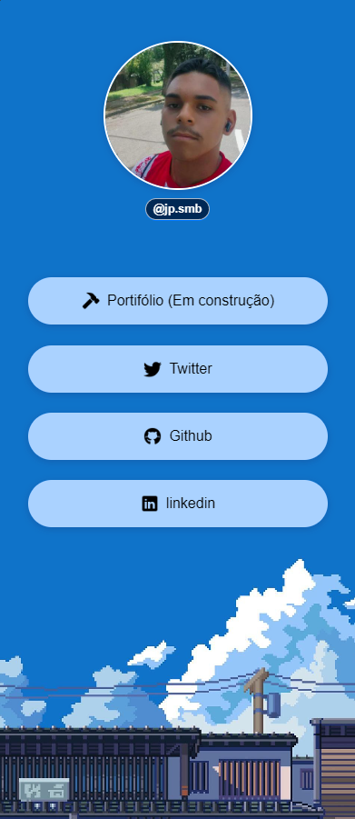

<h1>
    
    <p>All social media links in one place 🤖</p>
</h1>

<h1><a href="https://bio-links-social.vercel.app/">📱 See the website</a>
</h1>


## 📖 About
**BIO** is a simple project with the aim of connecting all social media links on a single website, which you can customize however you want.

## 🛠️ Tools

- [HTML](https://developer.mozilla.org/pt-BR/docs/Web/HTML)
- [CSS](https://developer.mozilla.org/pt-BR/docs/Web/CSS) 
- [Figma](https://www.figma.com/)

## 🔁 How to Contribute 
````bash
    #   Clone the project
    $ git clone https://github.com/jotape2709/BIO.git
````

````bash
    #    Enter in the directory
    cd BIO
````


## 📄 License

This project is under the MIT license.